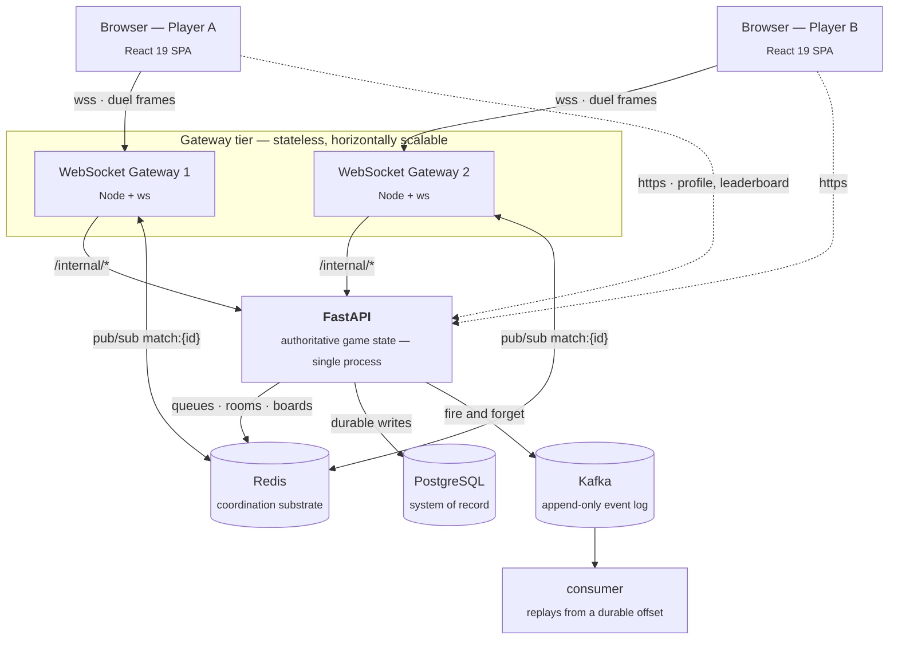
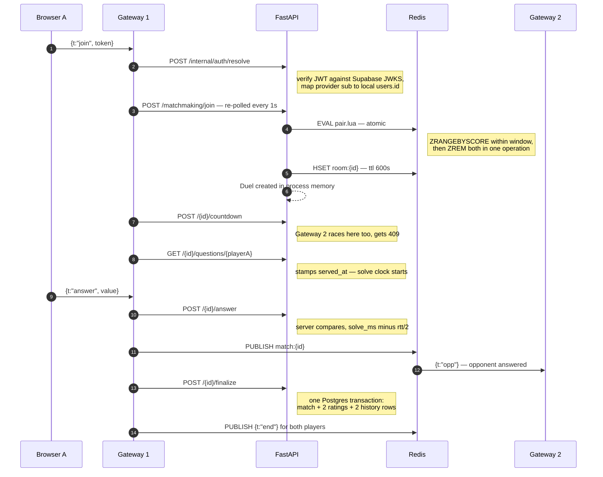
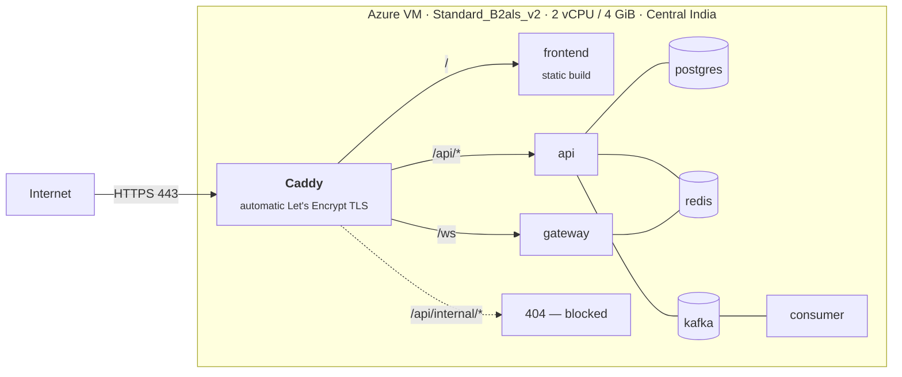

# MathDuel

**Real-time 1v1 mental-arithmetic duels.** Two players are matched by skill rating, race
through an identical set of seeded questions, and the result settles onto a Glicko-2
ladder — all in about two minutes.

### ▶︎ Live at **[mathduel.me](https://mathduel.me)**

<sub>Python · FastAPI · TypeScript · Node · React 19 · PostgreSQL · Redis · Kafka · Docker · Caddy · Azure</sub>

---

## Contents

- [What it does](#what-it-does)
- [Architecture](#architecture)
- [How a duel actually works](#how-a-duel-actually-works)
- [Engineering decisions and trade-offs](#engineering-decisions-and-trade-offs)
- [Data model](#data-model)
- [Deployment](#deployment)
- [Running it locally](#running-it-locally)
- [Testing](#testing)
- [Known limitations](#known-limitations)
- [Project layout](#project-layout)

---

## What it does

Sign in with Google, hit play, and you are matched against another player within a few
seconds. Both of you receive **the same questions in the same order**, generated from a
shared random seed — so the match is provably fair without either client ever being sent
an answer. First to the end wins; ties break on genuine thinking time, not on who has the
better internet connection.

Wins and losses move a **Glicko-2 rating**, which in turn decides your difficulty tier and
who you get matched against next.

---

## Architecture

Three services, three stores, and one authoritative referee in the middle.



**The browser holds two connections.** Ordinary reads — profile, leaderboard, queue sizes —
go straight to the API over HTTPS. Everything inside a duel goes over a WebSocket to the
gateway, which decides nothing itself: it translates socket frames into HTTP calls against
the API and relays answers back.

**The two players need not share a gateway.** Their only meeting points are the API, which
owns the match, and a Redis pub/sub channel carrying each player's moves to wherever the
other one happens to be connected.

| Component | Responsibility | Scaling |
|---|---|---|
| **React SPA** | UI, hash routing, Supabase auth, WebSocket client with backoff | static, CDN-able |
| **Node gateway** | Holds sockets, measures RTT, drives one local player through one match | **stateless — add instances freely** |
| **FastAPI** | All game rules, scoring, matchmaking, ratings. Single source of truth | single process ([see below](#known-limitations)) |
| **PostgreSQL** | Users, ratings, matches, rating history, leaderboard snapshots | system of record |
| **Redis** | Matchmaking queues, room registry, leaderboards, cross-gateway pub/sub | disposable, rebuildable |
| **Kafka** | Every question served, answer submitted, match started and finished | fully optional at runtime |

---

## How a duel actually works

Both gateways run this concurrently, one per player. Every step both would perform twice —
countdown, tick, finalize — is guarded so the second caller gets a `409` and carries on.



---

## Engineering decisions and trade-offs

The parts worth talking through.

### Matchmaking is one atomic Lua script

**Problem.** Two players polling simultaneously could both claim the same opponent, producing
two matches containing the same person.

**Decision.** Search and removal run as a single Redis Lua script — `ZRANGEBYSCORE` within a
rating window, pick the closest, then `ZREM` both players in the same indivisible operation.

**Trade-off.** Redis is single-threaded during the script, so this serialises all pairing for
a tier. At this scale that costs nothing; at very high volume it becomes the bottleneck and
would want sharding by tier. Simple and correct beat fast and complicated.

### Fairness that decays on purpose

The acceptable rating gap starts at ±50 and widens by 50 every 3 seconds, capped at ±1000.

The trade-off is stated in the code itself: *"Quality vs speed, made explicit. Narrow = fair
but slow; wide = fast but mismatched. We favour speed: an app that feels empty dies."* A
perfectly matched duel nobody waits around for is worth less than a slightly uneven one that
starts in four seconds.

The window is recomputed **server-side** from a reported wait time, never trusted as a raw
window value from the client.

### Latency compensation — penalised for thinking, not for your connection

The gateway measures round-trip time with WebSocket ping/pong and reports it to the API. When
an answer lands, the server computes `(now − served_at) − rtt/2`.

Ranking is then most correct first, then lowest total solve time — so a player on a 300 ms
connection competes fairly against one on 20 ms. Arrival order is never used.

### The gateway is stateless; state lives in Redis

Rooms, queues and the player-to-match index all live in Redis. The gateway holds **only
sockets**.

**What this buys:** any number of gateway instances, no sticky sessions, two players in one
match can sit on entirely different processes, and a reconnect can land anywhere and resume
correctly.

**Cost:** every gameplay action becomes a network hop to Redis or the API rather than a local
memory read. Worth it — this is the difference between a demo and something that scales.

### Idempotency instead of distributed locks

Both gateways notice a match has ended, and both call `finalize`. Rather than coordinate, the
`matches` table's **primary key doubles as the idempotency key**: the second insert raises a
unique violation, surfaces as `AlreadyRated` → HTTP 409, and that gateway carries on.

Exactly one rating change, exactly one `match_finished` event, **no coordination protocol at
all**. The same pattern guards `countdown` and `tick`.

### A deliberate transaction boundary

The match row, both Glicko-2 rating upserts and both history rows are written in **one
Postgres transaction**. The Redis leaderboard update sits deliberately *outside* it, because
Redis cannot roll back alongside Postgres.

If the board write fails it is logged and dropped — the ladder stays correct, and
`rebuild_from_postgres` recomputes the board from the match rows. **Redis is treated as a
disposable derived view throughout**, with a repair path rather than a guarantee.

### Kafka can never stall a player

`emit()` is deliberately **not `async`**, so no caller can await it — it spawns a task and
returns. If the broker is unreachable at startup the producer is simply `None` and events are
dropped with a counter.

**Kafka being completely down cannot stop a match from starting.** Acks are leader-only,
because this is analytics, not money.

Answer events also carry their own tier, template, bucket tags and the player's rating frozen
at match creation — so analysis can group by rating band without joining back to
`question_served`, and without the post-match rating contaminating the row.

### Determinism from a seed

A match carries a 31-bit seed chosen at pairing. Both question lists are generated once from
that seed plus the tier's JSON config, so both players provably solve identical problems while
**no client is ever sent an answer** — comparison happens server-side only.

Replaying any historical match needs only the seed and the `tier_config_version` stored on the
match row.

### Auth is delegated; identity is local

Supabase issues the JWT and handles Google OAuth. The API verifies it against Supabase's JWKS
endpoint (RS256/ES256, issuer *and* audience required), then maps the provider's `sub` onto a
local `users.id`.

Nothing downstream ever sees a Supabase subject — the gateway resolves once at join and works
in local UUIDs thereafter. **Swapping identity providers touches one module.**

### The reverse proxy enforces a boundary the API assumes

`/internal/*` has no authentication on any of its routes, by design — it presumes a private
link between gateway and API. Caddy therefore returns `404` for that whole prefix from the
public internet, and separately blocks the two unauthenticated leaderboard write endpoints
that sit *outside* that prefix.

Without those rules, anyone could create matches, submit answers as another player, and move
the ladder.

---

## Data model

| Table | Key | Purpose |
|---|---|---|
| `users` | `id` UUID; unique `(auth_provider, provider_subject)` | Maps a Supabase identity to a local user. Usernames derive from the email prefix, with a numeric suffix on collision |
| `ratings` | `(user_id, tier)` | Glicko-2 triple — rating, RD, volatility — plus `games_played`. A separate rating per tier |
| `matches` | `id` TEXT | Immutable match record: tier, seed, config version, both players, winner, scores. **Its PK enforces finalize-once** |
| `rating_history` | `BIGSERIAL` | Before/after per player per match, indexed for rating graphs |
| `leaderboard_snapshots` | `BIGSERIAL` | Periodic materialisation of the Redis boards, bounding Redis loss to one day of drift |

Leaderboards are Redis sorted sets — a global board per tier plus a weekly board keyed by ISO
week that expires a week after it closes. Ranking a single player is `ZREVRANK`: logarithmic,
not a scan.

---

## Deployment

Single host, eight containers, one published port pair.



| Layer | Choice | Why |
|---|---|---|
| **Host** | Azure VM, Ubuntu 24.04 | Predictable cost, full control, no PaaS restrictions on long-lived WebSockets |
| **Orchestration** | Docker Compose | Right-sized for one host; Kubernetes would be ceremony without benefit |
| **TLS / routing** | Caddy | Automatic certificate issuance and renewal, native WebSocket upgrade, one config file |
| **DNS** | Namecheap → A record | `www` gets a certificate and a 301 to the apex, keeping one canonical origin |
| **Auth** | Supabase (Google OAuth) | Delegating identity means never storing credentials |
| **Databases** | Self-hosted containers | Managed equivalents cost more than the VM itself at this scale |

**Only ports 80 and 443 are published.** Postgres, Redis, Kafka, the API and the gateway have
no published ports at all — they are reachable solely on the internal Docker network.

```bash
docker compose -f docker-compose.prod.yml up -d --build
```

Frontend environment values are **build arguments, not runtime env**: Vite inlines them into
the bundle, so changing the domain means rebuilding the image rather than restarting a
container.

---

## Running it locally

```bash
git clone https://github.com/nithinj25/math_dual.git
cd math_dual
cp .env.example .env          # infra connection strings
docker compose up -d          # postgres, redis, kafka

# API
cd api && pip install -r requirements.txt
uvicorn main:app --reload --port 8000

# Gateway
cd gateway && npm install && npm run dev

# Frontend
cd frontend && cp .env.example .env    # add your Supabase project values
npm install && npm run dev
```

Open <http://localhost:5173>. `./dev.sh` brings the whole stack up in one command.

Set `AUTH_MODE=fake` to mint HS256 test tokens without Supabase — the module refuses to load
in that mode when `ENVIRONMENT=production`.

---

## Testing

**25 tests** across the pieces where correctness is subtle rather than obvious:

| Suite | Covers |
|---|---|
| `game/test_state.py` | State machine transitions, illegal actions, scoring, tie-breaks |
| `matchmaking/test_queue.py` | Window widening, atomic pairing under contention |
| `ratings/test_glicko2.py` | Rating maths against known values |
| `questions/test_generator.py` | Determinism from a seed, carry and borrow constraints |
| `e2e_test.py` | Full match lifecycle, including a deliberate mid-transaction crash proving rollback |

```bash
cd api && pytest
```

---

## Known limitations

Being straight about what is not done, because it is more useful than pretending.

**The API is single-process.** Live `Duel` objects live in a module-level dictionary in the
API process. Rooms are in Redis so a gateway can always *find* a match, but every call that
advances one must reach the process holding it. Running two replicas returns `DuelNotFound`
for matches the second did not create.

*Consequences:* an API restart drops in-flight duels, and a duel leaks in memory if a gateway
dies mid-match without issuing its close call.

*The fix* is the move already made for rooms — put duel state in Redis behind a single-writer
scheme. Everything else is already shaped for it, and the gateway tier, which was the harder
half, is genuinely ready to scale today.

**Migrations run once.** The `.sql` files are applied by Postgres's init hook on first boot;
there is no migration runner, so later changes are applied by hand. Alembic is the obvious
next step.

**No CI yet.** Tests run locally. A GitHub Actions workflow running `pytest` on every push is
the next commit.

**Single host, no redundancy.** If the VM dies, the site dies. Deliberate — redundancy costs
more than this project warrants today, and the compose file moves to any host unchanged.

---

## Project layout

```
api/                     FastAPI — all game rules, the single source of truth
  modules/
    auth/                JWT verification, provider identity to local user
    game/                state machine · in-memory registry · Redis rooms · HTTP surface
    matchmaking/         Lua pairing script, widening window, tier selection
    questions/           seeded generation, five templates, per-tier JSON configs
    ratings/             Glicko-2, and the one transaction that settles a match
    leaderboard/         Redis sorted sets, rebuild and snapshot repair paths
    events/              fire-and-forget Kafka producer
  consumer.py            replays the event log from a durable offset

gateway/src/             Node WebSocket tier — stateless
  wsServer.ts            local sockets, heartbeat, RTT measurement
  duelRoom.ts            drives one local player through one match
  bus.ts                 Redis pub/sub pair for cross-gateway delivery

frontend/src/            React 19 SPA
  lib/socket.ts          reconnect with exponential backoff, resumes into a live match
  screens/               landing · login · lobby · queue · duel · result · leaderboard

docker-compose.prod.yml  production stack
Caddyfile                TLS, routing, and the public/private trust boundary
```

Roughly 6,100 lines of Python, TypeScript and SQL.

---

<sub>Built by <a href="https://github.com/nithinj25">Nithin J</a> · <a href="https://mathduel.me">mathduel.me</a></sub>
